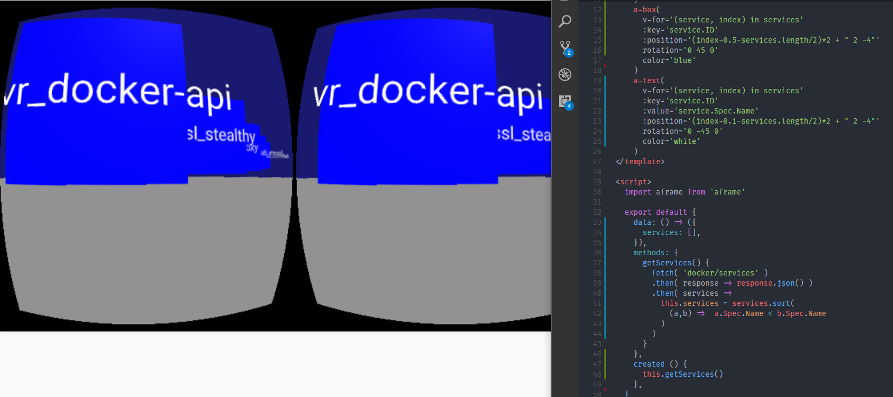

# VR Swarm 🐋
This application uses [VueJS](https://vuejs.org) and [A-Frame](https://aframe.io) to declaratively render Docker Swarm in VR on a web page:  


# quickstart
```bash
# you need a 1.13+/17.03+ swarm:
docker swarm init
# from the repo root:
docker deploy -c proxy-stack.yml proxy
docker deploy -c vr-swarm-stack.yml vr-swarm
# the app is now hosted on localhost at port 80
# the default config is to mount the src code into the frontend and hot-reload
```

# design
The application application runs as a docker stack on swarm mode with the following services:
## frontend
A web server responsible for serving a static bundle(`app.js`) of our VueJS application.  
The Vue app loads a component that long-polls docker API objects and presents them as DOM nodes in an Aframe scene.  

Currently, the only stack for this service is a NodeJS/Webpack server that builds the app on boot.  
Hot-Module-Reloads are enabled and the real-time VR dev experience is awesome.  
A production stack should be distributed in the future.  
## docker-api
We mount `ehazlett/docker-proxy` to a swarm-manager's socket and expose it to the frontend.  
This allows the frontend to consume the [Engine REST API](https://docs.docker.com/engine/api/get-started/).
## proxy
The frontend and backend should be served using HTTP path rules on the same origin.  
We use [traefik](https://traefik.io) as an unrelated cluster service to `PathPrefixStrip` `/docker` to the docker-api service.  
All other requests serve frontend assets.  


# hacking
At this point, the app is so simple that you only need to edit a single Vue Component: [src/components/Scene.vue](https://github.com/stealthybox/vr-swarm/blob/master/src/components/Scene.vue).  
It's fairly easy to modify.  
If you want to add new dependencies, the `Dockerfile` builds the frontend dev service.  

We'd love to hear your ideas!  
If you're a pro VR/A-Frame gamedev/hacker person and develop on a unique headset, we can learn from you.  

# contact
Please reach out via...  

Twitter:
- [Leigh ( capileigh )](https://twitter.com/capileigh)
- [Cody ( CodeMeister_P )](https://twitter.com/CodeMeister_P)

Slack:
- [Leigh ( docker-community / @stealthybox )](https://dockercommunity.slack.com/messages/@stealthybox)
